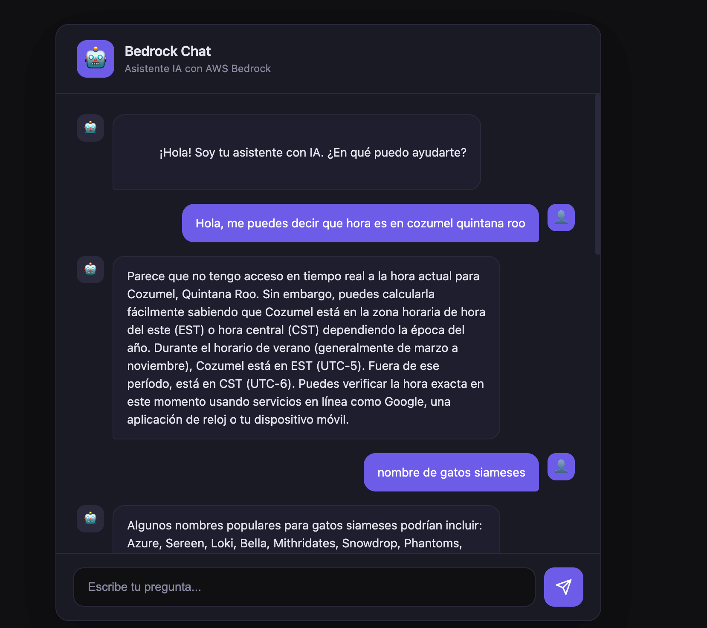

# Bedrock Chat - Asistente IA con AWS Bedrock

Chatbot inteligente construido con **NestJS** y **AWS Bedrock**, que utiliza modelos de lenguaje de Amazon (Nova) para responder preguntas en tiempo real a través de una interfaz web moderna.



## Tecnologías

- **Backend:** [NestJS](https://nestjs.com/) v11
- **IA:** [AWS Bedrock](https://aws.amazon.com/bedrock/) (modelo Amazon Nova 2 Lite por defecto)
- **Frontend:** HTML, CSS y JavaScript vanilla
- **Runtime:** Node.js
- **Package Manager:** pnpm

## Estructura del proyecto

```
nestjs-aws-bedrock/
├── src/
│   ├── main.ts                        # Punto de entrada de la aplicación
│   ├── app.module.ts                  # Módulo principal de NestJS
│   ├── app.controller.ts             # Controlador con endpoint POST /
│   ├── bedrock.service.ts            # Servicio de integración con AWS Bedrock
│   └── dto/
│       ├── ChatRequestDTO.ts          # DTO de petición del chat
│       └── ResponseInvokeModelDTO.ts  # DTO de respuesta del modelo
├── frontend/
│   ├── index.html                     # Interfaz del chatbot
│   ├── styles.css                     # Estilos de la interfaz
│   └── app.js                         # Lógica del frontend
├── test/                              # Tests e2e
├── .env.example                       # Variables de entorno de ejemplo
├── package.json
└── tsconfig.json
```

## Requisitos previos

- **Node.js** >= 18
- **pnpm** (o npm/yarn)
- **Cuenta de AWS** con acceso a Amazon Bedrock
- **Credenciales de AWS** configuradas localmente (`~/.aws/credentials` o variables de entorno)

## Instalación

1. **Clonar el repositorio:**

   ```bash
   git clone https://github.com/DanielVera987/nestjs-aws-bedrock.git
   cd nestjs-aws-bedrock
   ```

2. **Instalar dependencias:**

   ```bash
   pnpm install
   ```

3. **Configurar variables de entorno:**

   ```bash
   cp .env.example .env
   ```

   Edita el archivo `.env` con tus valores:

   ```env
   BEDROCK_MODEL_ID='us.amazon.nova-2-lite-v1:0'
   BEDROCK_REGION='us-east-2'
   ```

## Uso

### Iniciar el servidor en modo desarrollo

```bash
pnpm start:dev
```

El servidor se iniciará en `http://localhost:3000`.

### Iniciar en modo producción

```bash
pnpm build
pnpm start:prod
```

### Abrir el frontend

Abre el archivo `frontend/index.html` en tu navegador o sírvelo con cualquier servidor estático.

## API

### `POST /`

Envía una pregunta al modelo de IA.

**Request body:**

```json
{
  "question": "¿Cuál es la capital de México?"
}
```

**Response:**

```json
{
  "data": {
    "respuesta": "La capital de México es la Ciudad de México (CDMX)."
  }
}
```

### Ejemplo con cURL

```bash
curl -X POST http://localhost:3000 \
  -H "Content-Type: application/json" \
  -d '{"question": "¿Cuál es la capital de México?"}'
```

## Configuración de AWS Bedrock

1. Asegúrate de tener habilitado el acceso al modelo en la consola de AWS Bedrock.
2. Configura tus credenciales de AWS de alguna de estas formas:
   - Archivo `~/.aws/credentials`
   - Variables de entorno `AWS_ACCESS_KEY_ID` y `AWS_SECRET_ACCESS_KEY`
   - IAM Role (en caso de ejecutar en EC2/ECS/Lambda)

## Scripts disponibles

| Script              | Descripción                          |
|---------------------|--------------------------------------|
| `pnpm start`        | Inicia la aplicación                 |
| `pnpm start:dev`    | Inicia en modo desarrollo (watch)    |
| `pnpm start:debug`  | Inicia en modo debug (watch)         |
| `pnpm build`        | Compila el proyecto                  |
| `pnpm start:prod`   | Inicia la versión compilada          |
| `pnpm lint`         | Ejecuta el linter                    |
| `pnpm format`       | Formatea el código con Prettier      |
| `pnpm test`         | Ejecuta los tests unitarios          |
| `pnpm test:e2e`     | Ejecuta los tests end-to-end         |
| `pnpm test:cov`     | Genera reporte de cobertura          |

## Licencia

Este proyecto es de uso privado.
